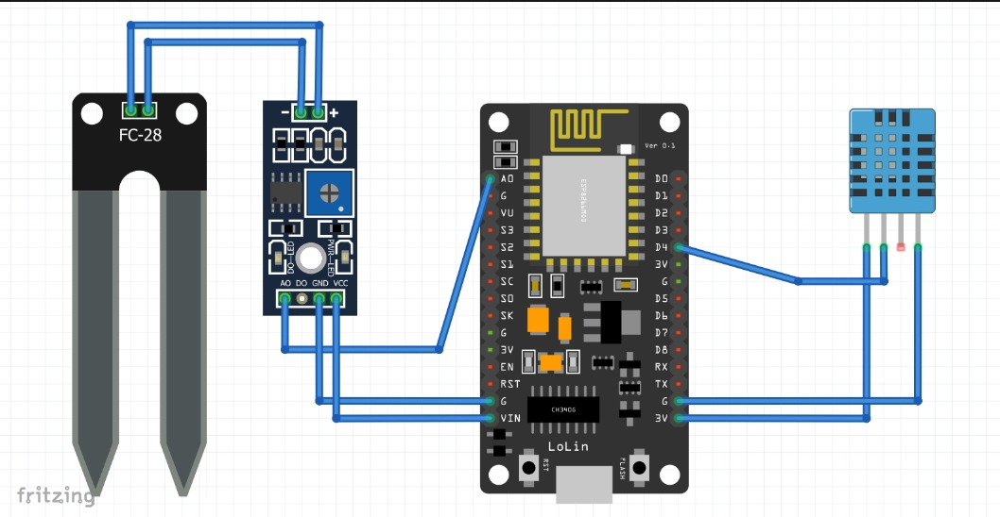
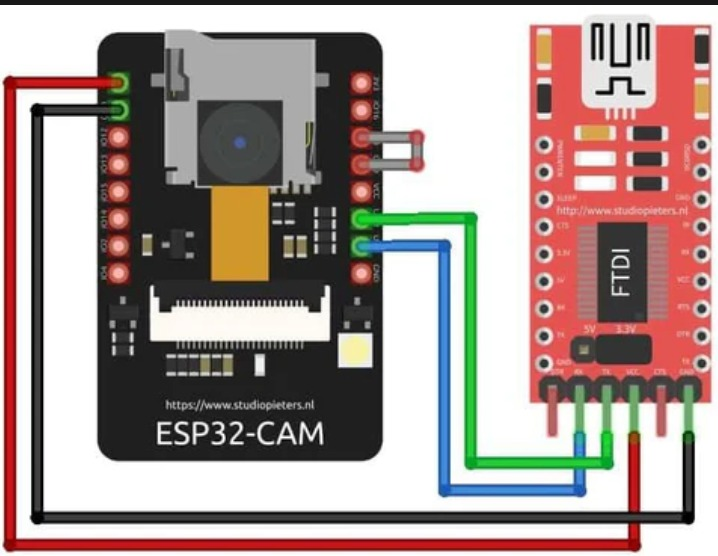

# 🌿 FarmLeaf Doctor – Plant Disease Detection with ESP32

FarmLeaf Doctor is a smart plant health monitoring and disease detection system using **ESP32**, **soil moisture**, **temperature & humidity sensors**, and a **CNN model** for image-based diagnosis. Built with **Streamlit** for a simple and interactive user interface.

---

## 🔧 Hardware Components

- ESP32 NodeMCU
- FC-28 Soil Moisture Sensor
- DHT11 or DHT22 Temperature & Humidity Sensor
- ESP32-CAM (optional for image capture)
- FTDI Programmer (for ESP32-CAM upload)

---

## 🔌 Circuit Diagrams

### 🌱 Soil & Environmental Sensing with ESP32


---

### 📷 ESP32-CAM with FTDI Connection



---

## 🧠 Features

- 📸 Image-based plant disease detection using a trained CNN (`plant_doctor.h5`)
- 🌡️ Real-time reading of temperature, humidity, and soil moisture
- 📊 Environmental condition matching for disease risk factors
- 🧪 Diagnosis + treatment + prevention suggestions
- 🌐 Streamlit-based web interface

---

## 🚀 How to Run

1. Connect sensors to ESP32 as per the circuit diagram.
2. Upload sensor code to ESP32 and check serial output.
3. Place `plant_doctor.h5` model in the project directory.
4. Install dependencies:

```bash
pip install streamlit tensorflow pillow numpy pyserial
```
5.Run Code
```bash
streamlit run app.py
```


